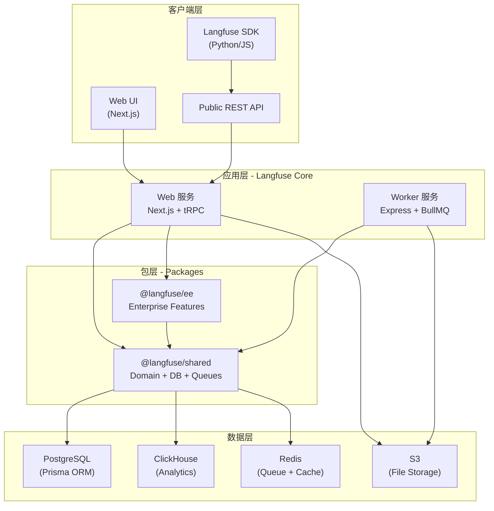
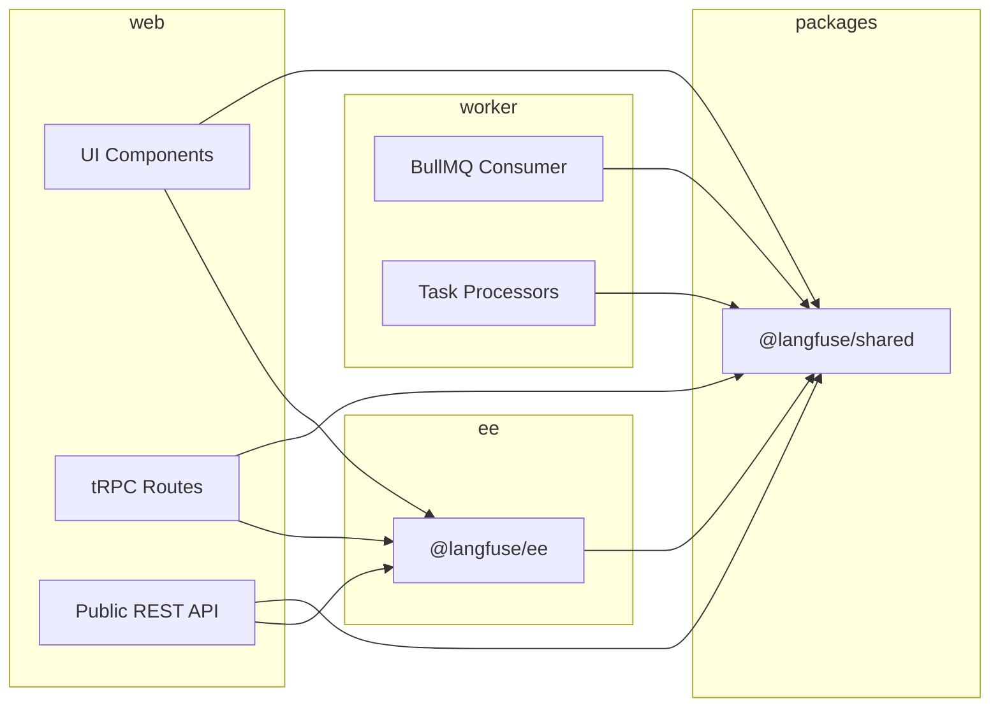
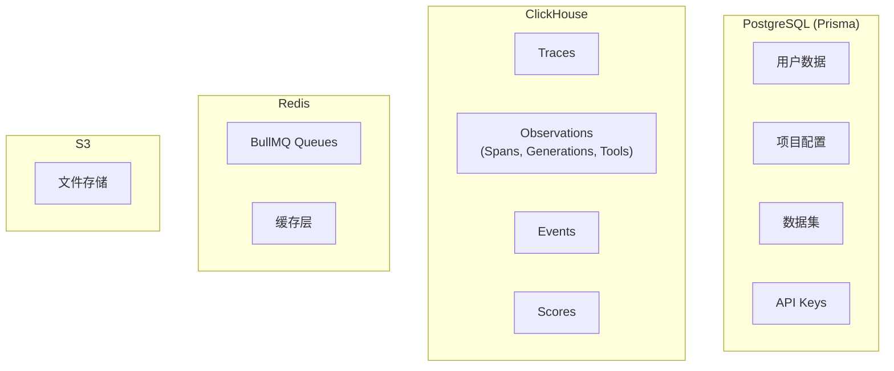

# Langfuse 架构文档

## 项目概览

Langfuse 是一个开源的 LLM 工程平台，用于开发、监控、评估和调试 AI 应用。采用 Monorepo 架构，使用 pnpm + Turbo 管理多包项目。

## 项目结构

```
langfuse/
├─ web/                     # Next.js 应用（UI + tRPC + Public REST API）
├─ worker/                  # 后台任务处理器（Express + BullMQ）
├─ packages/
│   ├─ shared/              # 共享包（DB/队列/领域模型）
│   ├─ config-typescript/   # TS 配置
│   ├─ config-eslint/       # ESLint 配置
│   └─ eslint-plugin/       # ESLint 插件
├─ ee/                      # 企业版包（被 web 消费）
├─ fern/                    # API 定义源（OpenAPI 生成）
├─ generated/               # 生成的 API 客户端
└─ scripts/                 # 仓库脚本
```

## 核心架构图



## 包依赖关系



**依赖规则：**
- `web` → `@langfuse/shared`, `@langfuse/ee`
- `worker` → `@langfuse/shared`
- `@langfuse/ee` → `@langfuse/shared`
- `@langfuse/shared` → **不导入** `web` / `worker` / `ee`

## 服务架构

### Web 服务

基于 Next.js 框架，负责处理：
- 用户界面渲染
- tRPC 内部 API 调用
- Public REST API（同步请求）

### Worker 服务

基于 Express + BullMQ，负责处理异步任务：
- **Ingestion** - 数据摄取处理
- **Evaluation** - 评估任务执行
- **Export** - 数据导出任务

## 数据存储架构



| 存储 | 用途 | 特点 |
|------|------|------|
| PostgreSQL | 事务性数据 | 用户、项目、配置等核心实体 |
| ClickHouse | 分析性数据 | Traces、Observations、Events、Scores |
| Redis | 队列和缓存 | BullMQ 任务队列、热点数据缓存 |
| S3 | 文件存储 | 上传文件、导出文件等 |

## 技术栈

| 类别 | 技术 |
|------|------|
| 运行时 | Node.js |
| 语言 | TypeScript (strict mode) |
| 包管理 | pnpm + Turbo |
| Web 框架 | Next.js |
| 任务队列 | BullMQ |
| ORM | Prisma (PostgreSQL) |
| 分析数据库 | ClickHouse |
| 缓存/队列 | Redis |
| 测试 | Vitest + Playwright |
| 部署 | Docker Compose / Kubernetes |

## 核心入口点

- **领域模型**: `packages/shared/src/domain/{observations,traces,scores}.ts`
- **Postgres Schema**: `packages/shared/prisma/schema.prisma`
- **ClickHouse 迁移**: `packages/shared/clickhouse/migrations/{clustered,unclustered}/*.sql`
- **队列定义**: `packages/shared/src/server/queues.ts`

## 相关链接

- [Langfuse 架构手册](https://langfuse.com/handbook/product-engineering/architecture)
